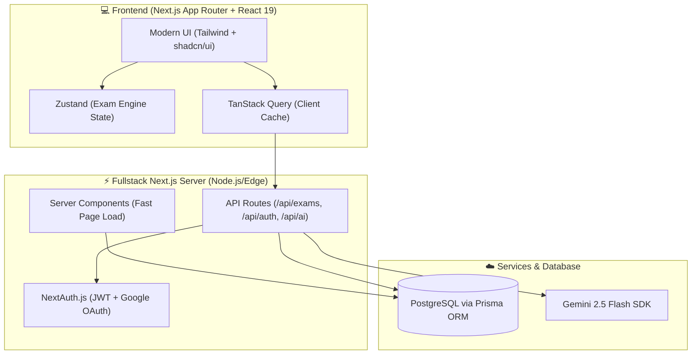
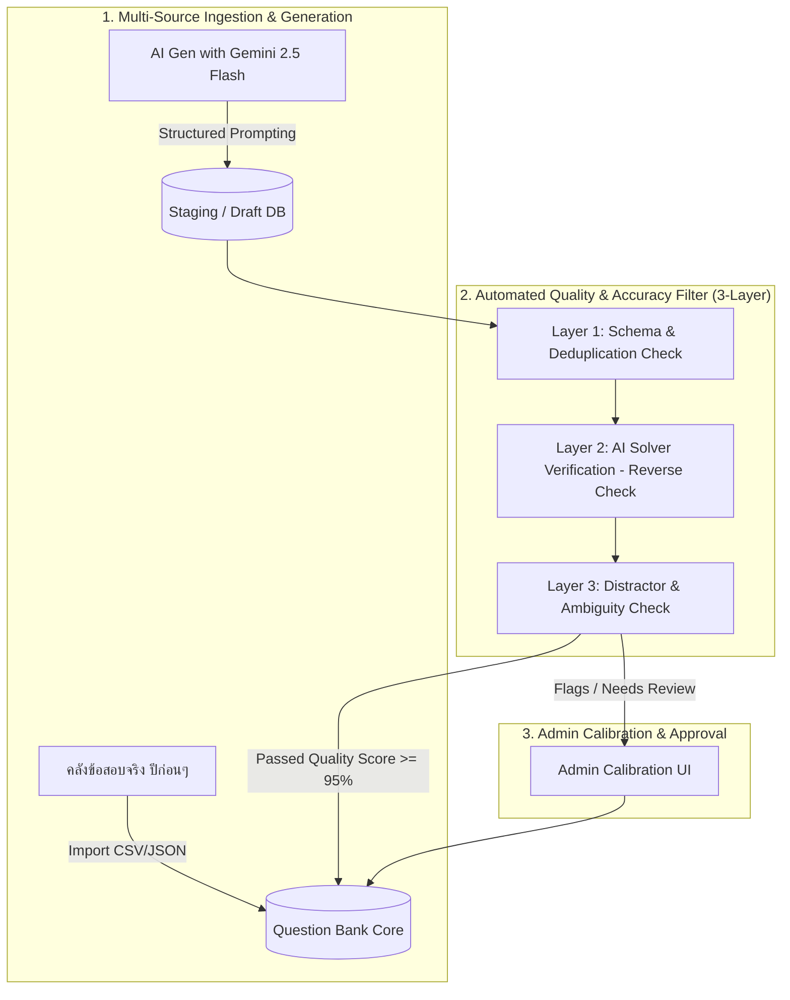
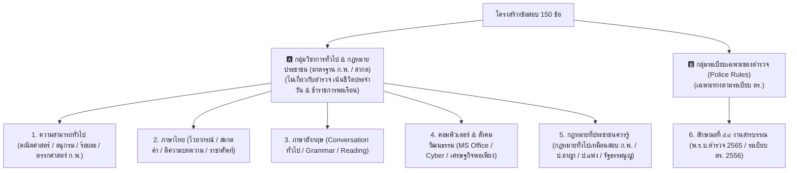

# 🏛️ พิมพ์เขียว: Police Exam 2.0 (Modern Re-architecture from Proven Blueprint)

> **วิสัยทัศน์การสร้างโปรเจกต์ใหม่:**
> 💡 **"เราไม่ได้เริ่มจากศูนย์ (Not Starting from 0) แต่เราสร้างใหม่ด้วยสปีดติดเทอร์โบ เพราะมีพิมพ์เขียวและต้นแบบที่สมบูรณ์แบบอยู่แล้ว 100%"**
> 
> * **หน้าตา (UI/UX):** รักษาความคุ้นเคย รูปลักษณ์ ธีมสี (`#BD1B0B`, `#FEF2F2`) และ Layout ทุกอย่างตามต้นแบบ
> * **ฟังก์ชันและระบบ:** มี Logic, โครงสร้างข้อมูล และ Flow การทำงานจาก V1 พร้อมให้หยิบมาแปลงเป็น Modern Tech ได้ทันที
> * **เครื่องยนต์ใหม่ (High-Performance Stack):** แปลงร่างเป็น **Next.js 15 Fullstack + TypeScript + Tailwind + Zustand** โค้ดสั้นลง 70% เร็วขึ้น 5 เท่า ไร้บั๊กเฉลยเพี้ยน และรองรับผู้สอบพร้อมกันได้เป็นหมื่นคน

---

## ⚡ ทำไมการสร้างใหม่ครั้งนี้ถึงเร็วมากและเสร็จไวใน 3 เดือน?

1. 🧭 **ไม่ต้องเสียเวลาคิด Flow การทำงานใหม่:**
   - หน้าระบบสอบ, การนับเวลา, การคำนวณคะแนน, คลัง 6 วิชา, ระบบน้องหมู, ระบบแบทเทิล, ระบบแอดมิน มีต้นแบบชัดเจนอยู่แล้ว
2. 🛡️ **รู้จุดที่เคยบั๊กและข้ามหลุมพรางได้ทันที:**
   - รู้แล้วว่าการเก็บ Index ข้อสอบต้องเป็นแบบไหน
   - รู้แล้วว่า AI Prompt ต้องล็อกด้วย Context และ JSON Schema อย่างไร
3. 📦 **แปลงโค้ดเก่าเป็นชิ้นส่วนโมเดิร์น (Refactor & Componentize):**
   - โค้ด HTML/JS ดิบขนาดยาว จะถูกรวบเป็น Component กระชับแค่ไม่กี่บรรทัด


---

## 🎨 1. แนวทางการรักษา UI/UX เดิมแบบ 1:1 (Design System Matching)

ถอดรหัส Design System และ Class จากโปรเจกต์เดิมมาแปลงเป็น Tailwind Components ให้หน้าตาเหมือนเดิมเป๊ะ:

| องค์ประกอบ UI เดิม | ค่าสีและสไตล์เดิมจาก V1 | โค้ด Tailwind ที่ใช้ใน V2 (ให้ผลลัพธ์เหมือนเดิมเป๊ะ) |
| :--- | :--- | :--- |
| **สีหลัก (Primary Red)** | `#BD1B0B` / `#C62828` | `bg-[#BD1B0B]` / `text-[#BD1B0B]` / `border-[#BD1B0B]` |
| **พื้นหลังปุ่มเลือกข้อ** | `#FFFFFF` ขอบ `#E2E8F0` | `bg-white border border-slate-200 hover:border-red-500` |
| **ปุ่มข้อที่เลือกแล้ว** | `#FEF2F2` ขอบ `#BD1B0B` | `bg-red-50 border-2 border-[#BD1B0B] text-red-900 shadow-sm` |
| **เฉลยข้อถูก (Review)** | `#ECFDF5` ขอบ `#059669` | `bg-emerald-50 border-2 border-emerald-600 text-emerald-900` |
| **เฉลยข้อผิด (Review)** | `#FEF2F2` ขอบ `#DC2626` | `bg-red-50 border-2 border-red-600 text-red-900` |
| **Badge ก/ข/ค/ง** | สี่เหลี่ยมมน `border-radius: 10px` | `w-8 h-8 rounded-xl flex items-center justify-center font-bold` |
| **Layout คลังข้อสอบ** | Grid การ์ด 6 หมวดวิชาหลัก | กริิดการ์ด 6 วิชาไอคอนและรูปแบบเดิม 100% |

---

## 🛠️ 2. เทคโนโลยีที่เลือกใช้ (Tech Stack Selection)



---

## 📁 2. ผังโครงสร้างไฟล์และโฟลเดอร์แบบชัดเจน (Project Tree)

```text
police-exam-v2/
├── prisma/
│   ├── schema.prisma                  # ฐานข้อมูลทั้งหมด (Users, Exams, Questions, Reports)
│   └── seed.ts                        # สคริปต์ลงข้อมูลเริ่มต้น (วิชา, บทเรียน)
│
├── src/
│   ├── app/                           # 🚀 Next.js App Router (หน้าบ้าน + หลังบ้าน)
│   │   ├── layout.tsx                 # Master Layout (Navbar, Theme, Providers)
│   │   ├── page.tsx                   # หน้า Landing Page ต้อนรับ
│   │   │
│   │   ├── (auth)/                    # 🔐 ระบบสมาชิก
│   │   │   ├── login/page.tsx         # หน้าเข้าสู่ระบบ (Email / Google One-Tap)
│   │   │   └── register/page.tsx      # หน้าสมัครสมาชิก
│   │   │
│   │   ├── (student)/                 # 🎓 ฝั่งนักเรียน / ผู้ใช้งาน
│   │   │   ├── dashboard/page.tsx     # สรุปคะแนน, กราฟพัฒนาการ, Streak วันที่ฝึกต่อเนื่อง
│   │   │   ├── bank/                  # คลังข้อสอบ
│   │   │   │   ├── page.tsx           # รายการ 6 หมวดวิชาหลัก & แยกตามบท
│   │   │   │   └── [subject]/page.tsx # ชุดข้อสอบในวิชานั้นๆ
│   │   │   ├── pretest/page.tsx       # สนามสอบจำลองเสมือนจริง 150 ข้อ (ปราบปราม/อำนวยการ)
│   │   │   └── exam/[setId]/          # 📝 ห้องทำข้อสอบ (Exam Engine)
│   │   │       ├── page.tsx           # หน้าทำข้อสอบ Real-time + จับเวลา
│   │   │       └── result/page.tsx    # หน้ารายงานผลคะแนน & เฉลยละเอียด
│   │   │
│   │   ├── admin/                     # 🛠️ ฝั่งผู้ดูแลระบบ (Admin Dashboard)
│   │   │   ├── page.tsx               # สรุปสถิติผู้ใช้, จำนวนข้อสอบ, รายงานข้อสอบ
│   │   │   ├── questions/             # ระบบจัดการ/ค้นหา/แก้ไขข้อสอบแบบ Real-time
│   │   │   ├── ai-generator/          # สั่ง AI Gen ข้อสอบยกชุด (ระบุหัวข้อ/จำนวนข้อได้)
│   │   │   ├── recheck/               # ระบบ AI Batch Recheck ตรวจเฉลยและคัดกรองบั๊กหลายชุด
│   │   │   └── reports/               # จัดการข้อสอบที่ผู้ใช้ส่งรายงานเข้ามา
│   │   │
│   │   └── api/                       # ⚡ Backend API Endpoints (อยู่ในโปรเจกต์เดียวกัน)
│   │       ├── auth/[...nextauth]/    # จัดการ Login / Session
│   │       ├── exams/
│   │       │   ├── route.ts           # ดึงชุดข้อสอบ / สร้างชุดข้อสอบ
│   │       │   └── [id]/questions/    # ดึงข้อสอบในชุดนั้นๆ
│   │       ├── submission/route.ts    # ส่งคำตอบ & คำนวณคะแนน & บันทึกประวัติ
│   │       ├── ai/
│   │       │   ├── generate/route.ts  # ยิง Gemini Gen ข้อสอบ
│   │       │   └── recheck/route.ts   # ยิง Gemini ตรวจเฉลยข้อสอบ
│   │       └── reports/route.ts       # รับและอัปเดตสถานะการแจ้งข้อสอบผิด
│   │
│   ├── components/                    # 🧩 ชิ้นส่วน UI (แบ่งเป็นชิ้นเล็กๆ ดูแลรักษาง่าย)
│   │   ├── ui/                        # ปุ่ม, Modal, Card, Progress Bar (shadcn/ui)
│   │   ├── exam/                      # ชิ้นส่วนในห้องสอบ:
│   │   │   ├── QuestionCard.tsx       # การ์ดโจทย์ + ตัวเลือก ก, ข, ค, ง
│   │   │   ├── ExamTimer.tsx          # นาฬิกานับถอยหลัง (Auto Submit เมื่อหมดเวลา)
│   │   │   ├── QuestionPalette.tsx    # แผงปุ่มกดลัดสลับข้อ (1-150)
│   │   │   ├── ReportModal.tsx        # หน้าต่างป๊อปอัปแจ้งข้อสอบผิด
│   │   │   └── ReviewView.tsx         # หน้าตรวจเฉลยละเอียด (เขียว/แดง)
│   │   └── admin/
│   │       ├── BatchProgress.tsx      # แถบแสดงความคืบหน้าการ Recheck หลายชุด
│   │       └── QuestionEditor.tsx     # กล่องแก้ไขโจทย์และตัวเลือกแบบสด
│   │
│   ├── stores/                        # 🧠 Zustand State (จัดการ State ทั้งหน้าจอ)
│   │   ├── useExamStore.ts            # State ข้อสอบ (ข้อปัจจุบัน, คำตอบที่เลือก, เวลา)
│   │   └── useAdminStore.ts           # State งาน Batch Queue ของ Admin
│   │
│   ├── lib/                           # 🔧 เครื่องมือและฟังก์ชันช่วยเหลือ
│   │   ├── prisma.ts                  # เชื่อมต่อ Database
│   │   ├── gemini.ts                  # กำหนด Prompt และเรียก Gemini 2.5 Flash
│   │   └── utils.ts                   # จัดรูปแบบเวลา, แปลงรหัสวิชา, คำนวณคะแนน
│   │
│   └── types/                         # 🛡️ Type Definition (ป้องกันบั๊กตั้งแต่ตอนพิมพ์)
│       └── index.ts                   # กำหนดโครงสร้าง Question, ExamSet, User, Report
```

---

## 🗄️ 3. Database Schema ฉบับสมบูรณ์ (`prisma/schema.prisma`)

```prisma
datasource db {
  provider = "postgresql"
  url      = env("DATABASE_URL")
}

generator client {
  provider = "prisma-client-js"
}

enum Role {
  USER
  ADMIN
  OWNER
}

enum Track {
  PRABPRAM     // สายปราบปราม (150 ข้อ)
  AMNUAYKAN    // สายอำนวยการ (150 ข้อ)
  GENERAL      // แบบทดสอบทั่วไป
}

model User {
  id            Int           @id @default(autoincrement())
  email         String        @unique
  username      String        @unique
  password      String?
  fullName      String
  role          Role          @default(USER)
  targetTrack   Track         @default(PRABPRAM)
  xp            Int           @default(0)
  level         Int           @default(1)
  streak        Int           @default(0)
  examHistories ExamHistory[]
  reports       Report[]
  createdAt     DateTime      @default(now())
  updatedAt     DateTime      @updatedAt
}

model ExamSet {
  id          Int        @id @default(autoincrement())
  title       String
  subjectKey  String     // thai, math, english, police_law, etc.
  chapter     String?
  track       Track      @default(GENERAL)
  totalCount  Int        @default(30)
  isPublic    Boolean    @default(true)
  questions   Question[]
  createdAt   DateTime   @default(now())
  updatedAt   DateTime   @updatedAt
}

model Question {
  id            Int       @id @default(autoincrement())
  examSetId     Int
  examSet       ExamSet   @relation(fields: [examSetId], references: [id], onDelete: Cascade)
  questionText  String
  choices       String[]  // Array 4 ตัวเลือก: [ก, ข, ค, ง]
  correctAnswer Int       // 0-indexed เสมอ: 0=ก, 1=ข, 2=ค, 3=ง (ไม่มีปัญหาเลขชนตัวเลือกแน่นอน!)
  explanation   String?
  sortOrder     Int       @default(0)
  reports       Report[]
  createdAt     DateTime  @default(now())
  updatedAt     DateTime  @updatedAt
}

model ExamHistory {
  id               Int      @id @default(autoincrement())
  userId           Int
  user             User     @relation(fields: [userId], references: [id], onDelete: Cascade)
  examSetId        Int?
  title            String
  score            Int
  totalQuestions   Int
  userAnswers      Json     // บันทึกคำตอบ { "0": 1, "1": 3, ... }
  timeSpentSeconds Int
  createdAt        DateTime @default(now())
}

model Report {
  id          Int      @id @default(autoincrement())
  userId      Int
  user        User     @relation(fields: [userId], references: [id])
  questionId  Int
  question    Question @relation(fields: [questionId], references: [id], onDelete: Cascade)
  reasonType  String   // WRONG_ANSWER, TYPO_ERROR, AMBIGUOUS
  details     String?
  status      String   @default("PENDING") // PENDING, RESOLVED, REJECTED
  createdAt   DateTime @default(now())
}
```

---

## 📅 4. แผนปฏิบัติการ 3 เดือนแบบละเอียดสัปดาห์ต่อสัปดาห์ (12 Weeks Plan)

```mermaid
gantt
    title แผนงานสร้าง Police Exam 2.0 (12 สัปดาห์)
    dateFormat  YYYY-MM-DD
    section เดือนที่ 1: วางรากฐาน & หลังบ้าน
    สัปดาห์ 1: Setup Next.js, Tailwind, Prisma DB  :w1, 2026-10-01, 7d
    สัปดาห์ 2: Auth (Login, Register, Google OAuth)  :w2, after w1, 7d
    สัปดาห์ 3: Admin จัดการข้อสอบ (CRUD + Search)   :w3, after w2, 7d
    สัปดาห์ 4: ระบบ Import/Export ข้อสอบ CSV/JSON   :w4, after w3, 7d
    section เดือนที่ 2: ระบบสอบ & ผู้เรียน
    สัปดาห์ 5: หน้า Dashboard สรุปสถิติ & คลังข้อสอบ :w5, 2026-11-01, 7d
    สัปดาห์ 6: Exam Engine (Zustand + จับเวลาจริง)   :w6, after w5, 7d
    สัปดาห์ 7: หน้าผลคะแนน & เฉลยละเอียด + รีพอร์ต :w7, after w6, 7d
    สัปดาห์ 8: Pretest 150 ข้อสายปราบปราม/อำนวยการ  :w8, after w7, 7d
    section เดือนที่ 3: AI อัจฉริยะ & Deploy
    สัปดาห์ 9: AI Generator สร้างข้อสอบยกชุด        :w9, 2026-12-01, 7d
    สัปดาห์ 10: AI Batch Recheck ตรวจหลายชุดพร้อมกัน :w10, after w9, 7d
    สัปดาห์ 11: ปรับแต่ง Performance & Mobile UI   :w11, after w10, 7d
    สัปดาห์ 12: Test ระบบเต็มรูปแบบ + Deploy Production :w12, after w11, 7d
```

### รายละเอียดรายสัปดาห์:

#### 🗓️ **เดือนที่ 1: วางรากฐาน & ระบบจัดการข้อมูล (Weeks 1 - 4)**
* **สัปดาห์ที่ 1 (Setup & Database):**
  - ติดตั้ง Next.js 15, TypeScript, Tailwind CSS, shadcn/ui
  - สร้างฐานข้อมูล PostgreSQL (Supabase / Neon) และรัน Prisma Migration
  - สร้าง Seed Data ข้อสอบตัวอย่างสำหรับทดสอบ
* **สัปดาห์ที่ 2 (Authentication & Security):**
  - ทำระบบสมัครสมาชิก, ล็อกอินด้วย Password (Bcrypt Hash)
  - เพิ่มปุ่มล็อกอินด้วย Google (NextAuth.js)
  - ทำ Middleware กั้นสิทธิ์ (User ทั่วไปห้ามเข้าหน้า `/admin`)
* **สัปดาห์ที่ 3 (Admin Exam Manager):**
  - หน้าแสดงรายการชุดข้อสอบ ค้นหา และกรองตามหมวดวิชา
  - ฟอร์มแก้ไขโจทย์ ตัวเลือก และเฉลยแบบทันที (Real-time Save)
* **สัปดาห์ที่ 4 (Import / Export & Clean up):**
  - ระบบนำเข้าข้อสอบจากไฟล์ Excel / CSV / JSON
  - ระบบคัดกรองข้อสอบซ้ำในระบบ

---

#### 🗓️ **เดือนที่ 2: ระบบทำข้อสอบ & ประสบการณ์ผู้เรียน (Weeks 5 - 8)**
* **สัปดาห์ที่ 5 (User Dashboard & Bank):**
  - หน้า Dashboard แสดงระดับ Level, ค่า XP, และกราฟคะแนนเฉลี่ยแต่ละวิชา
  - หน้าคลังข้อสอบ (Bank) แบ่งตาม 6 หมวดวิชาหลัก และแยกตามบทเรียน
* **สัปดาห์ที่ 6 (Exam Engine with Zustand):**
  - พัฒนาห้องสอบ: ข้อความโจทย์ใหญ่ชัดเจน, ตัวเลือก ก, ข, ค, ง แบบกดง่าย
  - ตัวจับเวลานับถอยหลัง (Timer) พร้อมระบบส่งคำตอบอัตโนมัติเมื่อหมดเวลา
  - แผงปุ่มทางลัดสลับข้อ (Question Palette)
* **สัปดาห์ที่ 7 (Exam Results & Review Mode):**
  - หน้าสรุปคะแนนรวม (Pass/Fail) พร้อมเรดาร์ชาร์ตวิเคราะห์จุดแข็ง-จุดอ่อน
  - โหมดตรวจเฉลยละเอียด (ข้อถูกขึ้นสีเขียว, ข้อผิดขึ้นสีแดง พร้อมคำอธิบาย)
  - ปุ่มกดส่งรายงานข้อสอบผิดพลาด (Report System)
* **สัปดาห์ที่ 8 (Pretest 150 ข้อเสมือนจริง):**
  - โหมดทดสอบเต็มรูปแบบ 150 ข้อ 3 ชั่วโมง (สายปราบปราม / สายอำนวยการ)
  - บันทึกประวัติการสอบลงในตาราง `ExamHistory`

---

#### 🗓️ **เดือนที่ 3: ระบบ AI อัจฉริยะ, ทดสอบ & ส่งมอบงาน (Weeks 9 - 12)**
* **สัปดาห์ที่ 9 (AI Exam Generator):**
  - เชื่อมต่อ SDK `@google/genai` (Gemini 2.5 Flash)
  - ระบบสั่งสร้างข้อสอบยกชุด 30 ข้อตามหัวข้อที่ต้องการ พร้อมเฉลยและคำอธิบาย
* **สัปดาห์ที่ 10 (AI Batch Recheck Engine):**
  - ระบบตรวจสอบข้อสอบหลายชุดพร้อมกัน (เช็คเฉลยผิด, คำผิด, ข้อซ้ำ)
  - แสดงผลต่างก่อน-หลัง (Diff View) และให้ Admin กดยืนยันการแก้ไขทีละชุด
* **สัปดาห์ที่ 11 (Performance & Mobile Optimization):**
  - ทำ Caching ด้วย React Query (สลับข้อสอบเร็วใน 0.001 วินาที)
  - ปรับ Responsive UI ให้ใช้งานบนสมาร์ตโฟนและแท็บเล็ตได้อย่างลื่นไหล 100%
* **สัปดาห์ที่ 12 (Full Testing & Production Deployment):**
  - ทำ End-to-End Testing (ทดสอบการทำข้อสอบตั้งแต่ข้อแรกจนถึงส่งผล)
  - Deploy ขึ้น Production บน **Vercel** + **Supabase Database**
  - ส่งมอบและเปิดให้ใช้งานจริง! 🎉

---

## 🎯 7. ระบบคลังข้อสอบจริง & เครื่องมือ AI Gen ระดับมืออาชีพ (Professional Engine)

การออกแบบระบบข้อสอบให้เทียบเท่ากับแพลตฟอร์มสอบระดับประเทศ (เช่น Dek-D, MonkeyEveryday, หรือ Pearson VUE) ประกอบด้วย 3 เสาหลัก:



---

### 🗄️ A. โครงสร้าง Database ข้อสอบจริงระดับมาตรฐานสากล (`prisma/schema.prisma`)

ออกแบบให้รองรับ **ข้อสอบจริงปีก่อนๆ (Past Papers)**, **ความยาก (Difficulty)**, **ทักษะการคิด (Bloom's Taxonomy)**, และ **สถิติความยากง่ายจริงจากการที่ผู้เรียนทำ (Item Analysis: p-value / r-value)**:

```prisma
enum SubjectKey {
  THAI          // ภาษาไทย
  MATH_GENERAL  // ความสามารถทั่วไป (คณิตศาสตร์ / อนุกรม / ตรรกศาสตร์)
  ENGLISH       // ภาษาอังกฤษ
  POLICE_LAW    // กฎหมายที่ประชาชนควรรู้ / กฎหมายตำรวจ
  POLICE_RULES  // ระเบียบงานสารบรรณตำรวจ / จริยธรรมตำรวจ
  COMPUTER_SOC  // เทคโนโลยีสารสนเทศ & สังคม วัฒนธรรม
}

enum Difficulty {
  EASY    // พื้นฐาน / ความจำ (จำกฎหมาย, คำศัพท์ตรงๆ)
  MEDIUM  // ประยุกต์ / คำนวณ (โจทย์คณิต, ตีความบทความ)
  HARD    // วิเคราะห์ซับซ้อน / กฎหมายหลายมาตรา / ดักข้อหลอก
}

model Question {
  id             Int          @id @default(autoincrement())
  subject        SubjectKey
  chapter        String       // เช่น "บทที่ 1 อนุกรม", "พ.ร.บ.ตำรวจแห่งชาติ 2565"
  tags           String[]     // ["ข้อสอบจริงปี65", "ปราบปราม", "อำนวยการ", "เน้นออกบ่อย"]
  
  // เนื้อหาข้อสอบ
  questionText   String       @db.Text
  choices        String[]     // Array ขนาด 4 ตัวเลือก ["ก", "ข", "ค", "ง"]
  correctAnswer  Int          // 0-indexed: 0=ก, 1=ข, 2=ค, 3=ง
  explanation    String       @db.Text // คำอธิบายเฉลยละเอียดและอ้างอิงมาตรา/สูตร
  reference      String?      // แหล่งอ้างอิง เช่น "ข้อสอบนายสิบตำรวจ สายปราบปราม พ.ศ. 2566 ข้อ 42"
  
  // มาตรฐาน & สถิติวัดผล (Item Analysis)
  difficulty     Difficulty   @default(MEDIUM)
  isVerified     Boolean      @default(false) // ผ่านการตรวจความแม่นยำแล้ว
  qualityScore   Float        @default(1.0)   // 0.0 - 1.0 (คะแนนความแม่นยำจาก AI/Admin)
  
  timesTested    Int          @default(0)     // จำนวนครั้งที่นักเรียนทำข้อนี้
  timesCorrect   Int          @default(0)     // จำนวนครั้งที่ตอบถูก (ไว้คำนวณความยากจริง)
  
  examSetId      Int?
  examSet        ExamSet?     @relation(fields: [examSetId], references: [id], onDelete: SetNull)
  reports        Report[]
  
  createdAt      DateTime     @default(now())
  updatedAt      DateTime     @updatedAt

  @@index([subject, chapter])
  @@index([isVerified])
}
```

---

### 🧠 B. ระบบ AI Generate ข้อสอบระดับมืออาชีพ (Few-Shot & Strict Context)

ปัญหาของระบบเดิมที่ AI เจนข้อสอบผิดบ่อย เกิดจากการสั่งแบบกว้างๆ (Zero-shot)  
ระบบใหม่จะใช้ **Prompt Engineering ระดับ Advance** โดยมีขั้นตอน:

1. **Context-Grounding (ป้อนระเบียบ/กฎหมายจริงเข้าไปใน Context):**
   - เช่น เมื่อต้องการเจนข้อสอบ "งานสารบรรณตำรวจ" จะส่งเนื้อหาระเบียบฉบับจริง พ.ศ. ๒๕๕๖ ให้ AI เป็นฐานอ้างอิง AI จะไม่อุปโลกน์ข้อกฎหมายขึ้นมาเอง
2. **Strict Output Schema ด้วย Gemini Structured Outputs (JSON Schema):**
   - บังคับให้ AI ส่งกลับเป็น JSON ที่ระบุเฉลยเป็นตัวเลข `0, 1, 2, 3` และต้องมีข้อความ "proof/เหตุผลที่ตัวเลือกอื่นผิด" ทุกข้อ

```typescript
// ตัวอย่าง Schema คำสั่ง Gen ข้อสอบระดับแม่นยำสูง
export const questionGenSchema = {
  type: "array",
  items: {
    type: "object",
    properties: {
      questionText: { type: "string", description: "โจทย์ข้อสอบที่ชัดเจน ไม่กำกวม" },
      choices: { 
        type: "array", 
        items: { type: "string" }, 
        minItems: 4, 
        maxItems: 4,
        description: "ตัวเลือก 4 ข้อที่ไม่ซ้ำซ้อนและเป็นไปได้จริง"
      },
      correctAnswer: { type: "integer", minimum: 0, maximum: 3, description: "Index เฉลย 0=ก, 1=ข, 2=ค, 3=ง" },
      explanation: { type: "string", description: "เฉลยละเอียด พร้อมระบุว่าทำไมตัวเลือกที่ถูกถึงถูกต้อง และทำไมตัวเลือกอื่นถึงผิด" },
      referenceLaw: { type: "string", description: "อ้างอิงมาตรา/ข้อบังคับกฎหมายจริง" },
      difficulty: { type: "string", enum: ["EASY", "MEDIUM", "HARD"] }
    },
    required: ["questionText", "choices", "correctAnswer", "explanation", "difficulty"]
  }
};
```

---

### 🛡️ C. ระบบคัดกรองความแม่นยำ 3 ชั้น (3-Layer Accuracy Verification)

ก่อนที่ข้อสอบจะถูกนำเข้าสู่ระบบให้นักเรียนทำ จะต้องผ่านระบบทดสอบความถูกต้องอัตโนมัติ:

#### 1️⃣ **Layer 1: ตรรกะพื้นฐาน & การซ้ำซ้อน (Deterministic Check)**
- ตรวจว่ามี 4 ตัวเลือกครบถ้วน และไม่มีตัวเลือกใดข้อความซ้ำกัน (Duplicate choices)
- ตรวจว่าไม่มีตัวเลือกประเภท *"ถูกทุกข้อ"* หรือ *"ไม่มีข้อใดถูก"* ที่ขัดแย้งกันเอง
- ตรวจสอบความซ้ำซ้อนของโจทย์กับคลังข้อสอบเดิมใน Database (Vector / Levenshtein Distance)

#### 2️⃣ **Layer 2: AI Reverse Solver (การตรวจเฉลยย้อนกลับ)**
- ส่งเฉพาะ `questionText` และ `choices` (โดย **ไม่ส่งเฉลย**) ไปให้ AI อีกตัว (AI Auditor) ลองทำข้อสอบเสมือนเป็นนักเรียน
- หาก AI Auditor ตอบได้ตรงกับ `correctAnswer` เดิม → **ผ่าน (Accuracy Confirmed)**
- หาก AI Auditor ตอบได้ไม่ตรงกัน → **ติด Flag ข้อนี้ทันที (Ambiguous / Questionable)** เพื่อส่งให้ Admin ตรวจมือ

#### 3️⃣ **Layer 3: Calibration & Difficulty Estimation (วิเคราะห์ตัวลวง)**
- วิเคราะห์ **ตัวลวง (Distractors)**: ตัวเลือกที่ผิดต้องเป็นตัวเลือกที่สมเหตุสมผล ไม่ใช่ข้อความไร้สาระ เพื่อให้วัดผลความรู้ของนักเรียนได้จริงตามหลักการออกข้อสอบมาตรฐาน

### 🎭 8. มาตรฐานการออกโจทย์แยกตามธรรมชาติของแต่ละหมวดวิชา (Subject-Specific Exam Logic)

ข้อสอบถูกแบ่งตามขอบเขตข้อสอบจริงอย่างแม่นยำ โดย **มีเพียงวิชาเดียวเท่านั้นที่เป็นระเบียบเฉพาะของตำรวจ คือ "ลักษณะที่ ๕๔ งานสารบรรณ"** นอกนั้นเป็นวิชาการทั่วไปและกฎหมายประชาชนทั่วไป (มาตรฐานเดียวกับ ก.พ. / ข้าราชการพลเรือน):



---

#### 📌 รายละเอียดขอบเขตการออกข้อสอบแต่ละวิชา:

##### 1. กฎหมายที่ประชาชนควรรู้ (มาตรฐานข้อสอบ ก.พ. / พลเรือนทั่วไป):
* **ขอบเขต:** สิทธิเสรีภาพตามรัฐธรรมนูญ, หลักกฎหมายแพ่งและพาณิชย์ (นิติกรรม, สัญญา, ละเมิด), หลักกฎหมายอาญาพื้นฐาน (เจตนา, ประมาท, ป้องกันตัว, ลัก วิ่ง ชิง ปล้น), กฎหมายคุ้มครองข้อมูลส่วนบุคคล (PDPA)
* **ตัวอย่างโจทย์จริง (โจทย์ชาวบ้านทั่วไป ไม่เกี่ยวกับตำรวจ):**
  > *"นายเอทำสัญญาเช่าบ้านจากนายบีเป็นเวลา 2 ปี โดยทำสัญญาเป็นหนังสือและลงลายมือชื่อทั้งสองฝ่าย แต่ไม่ได้ไปจดทะเบียนต่อพนักงานเจ้าหน้าที่ สัญญาเช่าฉบับนี้มีผลบังคับใช้ได้กี่ปี?"*
  > *(เฉลย: มีผลบังคับใช้ได้ 2 ปี เพราะการเช่าอสังหาริมทรัพย์ไม่เกิน 3 ปี เพียงมีหลักฐานเป็นหนังสือลงลายมือชื่อฝ่ายที่ต้องรับผิดก็ฟ้องร้องบังคับคดีได้)*

##### 2. ลักษณะที่ ๕๔ งานสารบรรณ (วิชาเฉพาะตำรวจวิชาเดียว):
* **ขอบเขต:** ประมวลระเบียบการตำรวจไม่เกี่ยวกับคดี ลักษณะที่ ๕๔ งานสารบรรณ (พ.ศ. ๒๕๕๖), ชนิดของหนังสือราชการตำรวจ, รหัสตัวพยัญชนะประจำหน่วยงาน ตร., ชั้นความเร็วและความลับ, การลงนามรับรองสำเนาถูกต้อง
* **ตัวอย่างโจทย์จริง:**
  > *"ตามประมวลระเบียบการตำรวจไม่เกี่ยวกับคดี ลักษณะที่ ๕๔ งานสารบรรณ (พ.ศ. ๒๕๕๖) รหัสพยัญชนะประจำส่วนราชการของ 'กองบัญชาการตำรวจนครบาล (บช.น.)' คือข้อใด?"*

##### 3. ความสามารถทั่วไป (คณิตศาสตร์ ก.พ.):
* **ขอบเขต:** อนุกรม, คณิตศาสตร์พื้นฐาน (ร้อยละ, กำไร-ขาดทุน, อัตราเร็ว, อายุ, ห.ร.ม./ค.ร.น.), ตารางข้อมูล, ตรรกศาสตร์, เงื่อนไขสัญลักษณ์ และเงื่อนไขภาษา

##### 4. ภาษาไทย:
* **ขอบเขต:** การสะกดคำถูกผิด, คำราชาศัพท์, สำนวนไทย, การใช้คำเชื่อม, การเรียงประโยค, การอ่านจับใจความและตีความบทความ

##### 5. ภาษาอังกฤษ:
* **ขอบเขต:** บทสนทนาในชีวิตประจำวัน (Situational Dialogue), ไวยากรณ์พื้นฐาน (Tenses, Passive Voice, Subject-Verb Agreement), คำศัพท์พื้นฐาน และการอ่านป้ายประกาศ/บทความสั้น

##### 6. คอมพิวเตอร์และเทคโนโลยีสารสนเทศ:
* **ขอบเขต:** ซอฟต์แวร์สำนักงาน (Word, Excel, PowerPoint), อินเทอร์เน็ต, คีย์ลัด, พ.ร.บ.คอมพิวเตอร์, ภัยคุกคามทางไซเบอร์

---

### 🤖 Dynamic AI Prompt Routing (ตรงสาย 100%)

```typescript
export function getSubjectPrompt(subjectKey: string): string {
  switch (subjectKey) {
    case 'MATH_GENERAL':
      return `คุณคือ "อาจารย์ผู้เชี่ยวชาญข้อสอบคณิตศาสตร์ ก.พ. ภาค ก"
เกณฑ์: สร้างโจทย์คณิตศาสตร์ อนุกรม ร้อยละ อัตราส่วน ตรรกศาสตร์ ก.พ. สากล ห้ามมีบริบทตำรวจเด็ดขาด`;

    case 'THAI':
      return `คุณคือ "อาจารย์ผู้เชี่ยวชาญข้อสอบภาษาไทย ก.พ. และข้อสอบราชการ"
เกณฑ์: ออกข้อสอบไวยากรณ์ การสะกดคำ คำราชาศัพท์ และการตีความบทความทั่วไปตามหลักภาษาไทย`;

    case 'ENGLISH':
      return `คุณคือ "Examiner ด้านข้อสอบภาษาอังกฤษราชการ ก.พ."
เกณฑ์: ออกข้อสอบ Conversation ในชีวิตประจำวัน, Vocabulary ทั่วไป, Grammar และ Reading ทั่วไป`;

    case 'POLICE_LAW': // กฎหมายประชาชนควรรู้ (เหมือน ก.พ.)
      return `คุณคือ "อาจารย์ผู้เชี่ยวชาญข้อสอบกฎหมาย ก.พ. (กฎหมายที่ประชาชนควรรู้)"
เกณฑ์: ออกข้อสอบสิทธิเสรีภาพ รัฐธรรมนูญ กฎหมายแพ่งและพาณิชย์เบื้องต้น นิติกรรมสัญญา และความรู้กฎหมายทั่วไปในชีวิตประจำวันของประชาชน ห้ามมีบริบทงานตำรวจ`;

    case 'COMPUTER_SOC':
      return `คุณคือ "ผู้เชี่ยวชาญด้านเทคโนโลยีสารสนเทศและสังคมศาสตร์ ก.พ."
เกณฑ์: ออกข้อสอบคอมพิวเตอร์สำนักงาน ความปลอดภัยไซเบอร์ เหตุการณ์ปัจจุบัน และปรัชญาเศรษฐกิจพอเพียง`;

    case 'POLICE_RULES': // ลักษณะที่ 54 งานสารบรรณ (วิชาตำรวจวิชาเดียว)
    default:
      return `คุณคือ "คณะกรรมการออกข้อสอบประมวลระเบียบการตำรวจไม่เกี่ยวกับคดี ลักษณะที่ ๕๔ งานสารบรรณ พ.ศ. ๒๕๕๖"
เกณฑ์: ออกข้อสอบตรงตามระเบียบงานสารบรรณตำรวจ พ.ศ. ๒๕๕๖ และ พ.ร.บ.ตำรวจแห่งชาติ ๒๕๖๕ เท่านั้น`;
  }
}
```


---

## ⚙️ 9. ผังการออกแบบระบบย่อยทั้งหมดอย่างละเอียด (Core Sub-systems Architecture)

เพื่อให้ระบบทำงานได้อย่างราบรื่น ไร้รอยต่อ และเป็นระดับมืออาชีพ ได้วางผังระบบหลักไว้ 5 ด้าน:

```mermaid
graph TD
    subgraph S1 ["1. Real-time Exam Engine"]
        E1[Zustand In-Memory State] --> E2[Background Auto-Save to LocalStorage]
        E2 --> E3[Heartbeat / Countdown Timer Web Worker]
        E3 --> E4[Batch Result Submission & Grade Processing]
    end

    subgraph S2 ["2. Gamification & Retention"]
        G1[XP & Level Progression Engine] --> G2[Daily Streak & Activity Calendar]
        G2 --> G3[Weakness Radar & Performance Insights]
    end

    subgraph S3 ["3. Admin Command Center"]
        A1[AI Auto-Gen & Staging Queue] --> A2[AI Multi-Set Batch Recheck]
        A2 --> A3[Report Resolution & Question Hotfix]
    end

    subgraph S4 ["4. Security & Integrity"]
        SEC1[NextAuth JWT with Role Guard] --> SEC2[Input Sanitization & Zod Schema]
        SEC2 --> SEC3[Rate Limiting & Anti-Cheat Tab Switching]
    end

    subgraph S5 ["5. Cloud Infrastructure"]
        INF1[Vercel Edge Network] --> INF2[PostgreSQL Serverless Neon/Supabase]
        INF2 --> INF3[Upstash Redis Caching]
    end
```



---

### 1️⃣ ระบบเครื่องยนต์ทำข้อสอบ (Real-time Exam Engine)
* **Zero-Lag State Management:** ใช้ `Zustand` ทำงานบน RAM ของเครื่องผู้เรียน สลับข้อได้ใน 0.001 วินาที
* **Crash-Proof LocalStorage Sync:** ทุกครั้งที่นักเรียนกดตอบ ข้อสอบจะถูกบันทึกสำรองไว้ใน `LocalStorage` อัตโนมัติ หากเน็ตหลุด, คอมดับ, หรือเผลอปิดแท็บ เมื่อเปิดใหม่จะทำต่อจากข้อเดิมได้ทันที 100%
* **Web Worker Timer:** นาฬิกาจับเวลานับถอยหลังจะทำงานแยกเธรด (Web Worker) ทำให้เวลานับตรงเป๊ะ แม้ผู้ใช้จะสลับไปเปิดแท็บอื่นหรือพับหน้าจอ

---

### 2️⃣ ระบบเกมมิฟิเคชัน & แรงจูงใจ (Gamification & Retention Engine)
* **Dynamic XP & Level Calculation:** 
  * ทำข้อสอบจบ 1 ชุด = +50 XP
  * ทำถูก 1 ข้อ = +10 XP
  * ปลดล็อกระดับชั้นยศจำลอง (ส.ต.ต. → ส.ต.ท. → ด.ต. → ร.ต.อ.) ตามคะแนนสะสม
* **Streak Tracking (ฝึกทำต่อเนื่อง):** บันทึกการเข้าทำข้อสอบรายวัน หากทำต่อเนื่อง 7 วัน จะได้รับโบนัส XP
* **Radar Chart วิเคราะห์จุดอ่อน:** กราฟใยแมงมุมวิเคราะห์คะแนน 6 หมวดวิชา บอกทันทีว่า *"วิชาภาษาไทยผ่านเกณฑ์แล้ว แต่วิชาคณิตศาสตร์ยังต้องฝึกเพิ่มอีก 15%"*

---

### 3️⃣ ระบบจัดการหลังบ้านระดับแอดมิน (Admin Command Center)
* **Real-time Question Editor:** แก้ไขข้อความโจทย์, ตัวเลือก ก-ง, หรือเฉลย แล้วระบบจะ Sync ไปยังคลังข้อสอบทันทีโดยไม่ต้อง Refresh หน้าจอ
* **Background AI Batch Queue:** สั่งตรวจข้อสอบพร้อมกัน 10-20 ชุด ระบบจะรันอยู่เบื้องหลังพร้อมแถบ Progress Bar ให้เห็นสถานะแบบ Real-time
* **1-Click Report Resolver:** เมื่อมีนักเรียนกดแจ้งข้อสอบผิด หน้าแอดมินจะแสดงข้อเปรียบเทียบ พร้อมปุ่ม *"อนุมัติแก้ไขตามรายงาน"* หรือ *"ปฏิเสธ"* ในคลิกเดียว

---

### 4️⃣ ระบบความปลอดภัย & ป้องกันการโกง (Security & Anti-Cheat)
* **Role-Based Access Control (RBAC):** กั้นสิทธิ์เด็ดขาดด้วย Next.js Middleware (`USER`, `ADMIN`, `OWNER`)
* **Anti-Cheat Monitoring:** ตรวจจับการสลับแท็บ (Tab Blur Event) ในโหมดสอบ Pretest 150 ข้อ หากสลับหน้าจอเกิน 3 ครั้งจะมีการเตือนและบันทึกในประวัติการสอบ
* **Rate Limiting & Zod Validation:** ป้องกันการยิงสแปม API หรือส่งข้อมูลแปลกปลอมเข้าสู่ฐานข้อมูล

---

### 5️⃣ โครงสร้างพื้นฐาน & ระบบคลาวด์ (Cloud & DevOps)
* **Frontend & API:** Deploy บน **Vercel** (Global Edge CDN โหลดไวทั่วประเทศ)
* **Database:** **PostgreSQL บน Neon / Supabase** (ระบบ Auto-Scale รองรับผู้สอบหลักหมื่นคน)
* **Cache:** **Upstash Redis** แคชชุดข้อสอบยอดนิยม ทำให้อ่านข้อมูลได้ในระดับ Millisecond โดยไม่เปลืองโหลด Database

---

## 🚀 สรุปผลลัพธ์ที่จะได้ในระบบใหม่:
1. **โค้ดสั้นและเป็นระเบียบ:** ทั้งโปรเจกต์เหลือโค้ดประมาณ 9,000 บรรทัด (จากเดิม 38,000 บรรทัด)
2. **ความเร็วสูงระดับโมเดิร์น:** โหลดข้อสอบและผลคะแนนได้ทันที ไม่มีอาการค้างหรือหมุนเคว้ง
3. **ดูแลรักษาง่าย:** แก้ไขหรือเพิ่มฟีเจอร์ใหม่ในอนาคตได้ทันทีโดยไม่ต้องกลัวโค้ดพัง
4. **ประสบการณ์ผู้ใช้ระดับสากล:** สอบลื่นไหล ไม่เด้ง ไม่หลุด มีระบบช่วยจำและวิเคราะห์จุดอ่อนครบวงจร!


